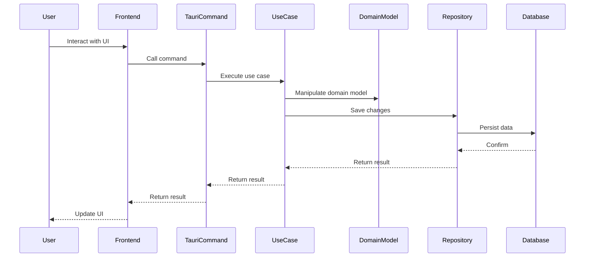
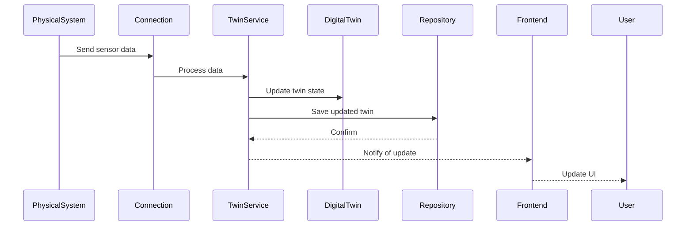

# Digital Twin Desktop Architecture

## Overview

The Digital Twin Desktop is a cross-platform desktop application built with Rust and Tauri, designed to create, monitor, and interact with digital twins of physical systems. This document provides a high-level overview of the application's architecture, design principles, and key components.

## Architectural Principles

The application follows Clean Architecture (also known as Onion or Hexagonal Architecture) principles to ensure maintainability, testability, and flexibility.

### Clean Architecture Layers


1. **Core Domain Layer** (Innermost)
   - Contains pure business logic and domain models
   - Has no external dependencies
   - Defines interfaces that outer layers implement

2. **Application Layer**
   - Contains use cases that orchestrate domain logic
   - Depends only on the Core Domain layer
   - Implements business workflows

3. **Infrastructure Layer**
   - Contains implementations of interfaces defined in Core
   - Handles external integrations (LLM APIs, database, file system)
   - Adapts external libraries to work with our domain

4. **API Layer**
   - Contains Tauri commands for frontend-backend communication
   - Depends on the Application layer
   - Handles serialization/deserialization of data

### Dependency Rule

The fundamental rule of Clean Architecture is that dependencies can only point inward:

- Inner layers never depend on outer layers
- Outer layers depend on inner layers through interfaces (traits)
- Domain models are pure and don't contain infrastructure concerns

## Technology Stack

### Backend (Rust)

- **Core Framework**: Tauri 2.0+
- **Async Runtime**: Tokio
- **Serialization**: Serde
- **Database**: SQLite (via rusqlite)
- **HTTP Client**: reqwest
- **WebSocket**: tokio-tungstenite
- **LLM Integration**: async-openai, anthropic-sdk
- **Error Handling**: thiserror, anyhow
- **Logging**: tracing
- **Cryptography**: ring
- **Industrial Protocols**: modbus, mqtt

### Frontend (TypeScript/React)

- **Framework**: React 18+
- **Type System**: TypeScript
- **State Management**: Zustand
- **API Client**: React Query
- **Styling**: Tailwind CSS
- **UI Components**: Custom components
- **Visualization**: D3.js, Three.js

## Component Structure

```
src/
├── core/               # Domain and Application Layers
│   ├── domain/         # Domain models and business logic
│   │   ├── models/     # Entity definitions
│   │   ├── traits/     # Core interfaces
│   │   ├── errors.rs   # Domain-specific errors
│   │   └── value_objects.rs
│   └── application/    # Application Layer
│       ├── use_cases/  # Business workflows
│       ├── services/   # Domain services
│       ├── commands.rs # Command objects
│       ├── queries.rs  # Query objects
│       ├── dtos.rs     # Data Transfer Objects
│       └── events.rs   # Domain events
├── infrastructure/     # Infrastructure Layer
│   ├── llm/            # LLM provider implementations
│   ├── db/             # Database implementations
│   │   ├── repositories/ # Repository implementations
│   │   └── migrations/   # Database migrations
│   ├── tools/          # Tool implementations
│   ├── security/       # Security implementations
│   ├── config.rs       # Configuration management
│   └── logging.rs      # Logging infrastructure
└── api/                # API Layer (Tauri Commands)
    ├── commands/       # Command handlers
    ├── middleware/     # API middleware
    ├── dto.rs          # API-specific DTOs
    └── error.rs        # API error handling
```

## Key Components

### Domain Models

The core domain models represent the business entities and their behavior:

- **Agent**: Represents an AI agent that can process user requests and execute tools
- **Conversation**: Represents a conversation between a user and an agent
- **DigitalTwin**: Represents a digital twin of a physical system
- **SensorData**: Represents data from sensors in the physical system
- **Tool**: Represents a tool that an agent can use

### Use Cases

Use cases implement specific business operations:

- **CreateConversation**: Creates a new conversation
- **SendMessage**: Sends a message in a conversation
- **CreateTwin**: Creates a new digital twin
- **SyncTwin**: Synchronizes a digital twin with its physical counterpart
- **RunSimulation**: Runs a simulation on a digital twin
- **ExecuteTool**: Executes a tool on behalf of an agent

### Repositories

Repositories provide an abstraction over data storage:

- **ConversationRepository**: Stores and retrieves conversations
- **TwinRepository**: Stores and retrieves digital twins
- **SensorDataRepository**: Stores and retrieves sensor data
- **AgentRepository**: Stores and retrieves agent configurations
- **ToolRepository**: Stores and retrieves tool configurations

### Services

Services implement domain logic that doesn't naturally fit within a single entity:

- **ConversationService**: Manages conversation state and history
- **TwinService**: Manages digital twin operations
- **AgentService**: Manages agent behavior and tool execution
- **SimulationService**: Manages simulation execution
- **ToolService**: Manages tool registration and execution

### Agent System

The agent system is a key component that enables intelligent interaction with digital twins:

- **Orchestrator**: Central coordinator of agent activities
- **State Machine**: Manages agent states and transitions
- **Context Manager**: Builds and maintains the agent's context
- **Reasoning Engine**: Implements planning and reflection capabilities
- **Tool System**: Provides a registry of available tools

### Digital Twin System

The digital twin system enables the creation and management of digital twins:

- **Twin Model**: Core representation of the twin's structure and behavior
- **Sensor Management**: Handles sensor data collection and processing
- **Actuator Control**: Manages actuator state and commands
- **Simulation Engine**: Runs simulations on digital twins
- **Connection Management**: Manages connections to physical systems

### Tool System

The tool system allows agents to interact with the outside world:

- **Tool Interface**: Defines the common interface for all tools
- **Tool Registry**: Manages tool registration and discovery
- **Tool Executor**: Executes tools with proper sandboxing
- **Tool Categories**: Organizes tools by functionality

## Communication Flow

1. User interacts with the React frontend
2. Frontend calls Tauri commands
3. Commands validate inputs and call appropriate use cases
4. Use cases orchestrate domain models and repositories
5. Repositories interact with the database or external services
6. Results flow back through the same layers
7. Frontend updates based on the results

## Data Flow

### User Interaction Flow



### Digital Twin Synchronization Flow



## Error Handling

The application uses a layered approach to error handling:

1. **Domain Errors**: Defined in the domain layer, represent business rule violations
2. **Application Errors**: Wrap domain errors and add application-specific context
3. **Infrastructure Errors**: Wrap external errors (e.g., database errors) and map them to domain concepts
4. **API Errors**: Map all errors to user-friendly messages for the frontend

## Security Architecture

The application implements several security measures:

1. **API Key Encryption**: Encrypts API keys at rest
2. **Sandboxed Tool Execution**: Limits what tools can do
3. **Input Validation**: Validates all inputs before processing
4. **Permission System**: Controls access to sensitive operations
5. **Rate Limiting**: Prevents abuse of external APIs

## Performance Considerations

Performance is optimized through:

1. **Connection Pooling**: Reuses database connections
2. **Caching**: Caches expensive operations
3. **Async Processing**: Uses Tokio for asynchronous operations
4. **Streaming Responses**: Streams LLM responses for better UX
5. **Efficient Data Structures**: Uses appropriate data structures for different operations

## Deployment Architecture

The application can be deployed in two modes:

1. **Desktop Application**: Runs as a standalone desktop application
2. **Headless Server**: Runs as a server without a UI, accessible via API

## Future Extensibility

The architecture is designed for extensibility:

1. **Plugin System**: Allows adding new tools and capabilities
2. **Multiple LLM Support**: Can switch between different LLM providers
3. **Custom Twin Types**: Can define custom digital twin types
4. **Alternative Storage**: Can use different storage backends
5. **Cloud Synchronization**: Can synchronize data with cloud services

## Design Patterns

The application uses several design patterns:

1. **Repository Pattern**: Abstracts data access
2. **Factory Pattern**: Creates complex objects
3. **Strategy Pattern**: Selects algorithms at runtime
4. **Observer Pattern**: Notifies components of changes
5. **Command Pattern**: Encapsulates requests as objects
6. **Dependency Injection**: Provides dependencies to components
7. **Adapter Pattern**: Adapts external interfaces to internal ones

## Testing Strategy

The application is tested at multiple levels:

1. **Unit Tests**: Test individual components in isolation
2. **Integration Tests**: Test components working together
3. **End-to-End Tests**: Test complete user workflows
4. **Property-Based Tests**: Test invariants across random inputs

## Conclusion

The Digital Twin Desktop architecture follows Clean Architecture principles to create a maintainable, testable, and flexible application. By separating concerns and defining clear boundaries between layers, the architecture enables the application to evolve and adapt to changing requirements while maintaining a solid foundation.

For more detailed information, refer to the specific documentation for each component in the `docs/` directory.