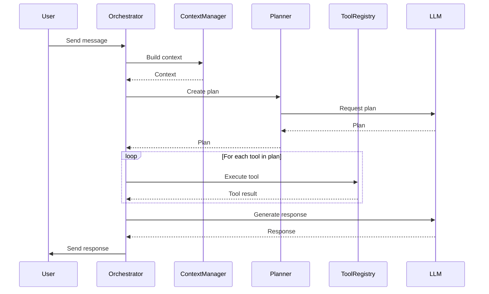

# Agent Design

## Overview

The Digital Twin Desktop application features an intelligent agent system that helps users interact with digital twins, run simulations, and analyze data. This document outlines the design principles, architecture, and implementation details of the agent system.

## Agent Architecture

The agent system follows a modular architecture with the following key components:

### 1. Orchestrator

The Orchestrator is the central coordinator of the agent system, responsible for:

- Managing the agent's state machine
- Routing messages between components
- Coordinating tool execution
- Handling error recovery

```rust
pub struct AgentOrchestrator<L: LlmClient, T: ToolRegistry> {
    state: AgentState,
    llm: L,
    tools: T,
    context_manager: ContextManager,
    planner: Planner,
    config: AgentConfig,
}
```

### 2. State Machine

The agent follows an explicit state machine pattern to ensure consistent behavior:

```rust
pub enum AgentState {
    Idle,
    Thinking { context: Context },
    ExecutingTool { tool: String, input: String },
    Responding { response_stream: ResponseStream },
    Error { error: AgentError },
}
```

State transitions are explicit and logged:

```rust
impl<L: LlmClient, T: ToolRegistry> AgentOrchestrator<L, T> {
    pub fn transition_to(&mut self, new_state: AgentState) {
        tracing::info!("Agent transitioning from {:?} to {:?}", self.state, new_state);
        self.state = new_state;
    }
}
```

### 3. Context Manager

The Context Manager builds and maintains the agent's context:

- Manages conversation history
- Handles token counting
- Implements intelligent context truncation
- Builds prompts for the LLM

```rust
pub struct ContextManager {
    max_tokens: usize,
    token_counter: TokenCounter,
    system_prompt: String,
}

impl ContextManager {
    pub fn build_context(&self, conversation: &Conversation) -> Context {
        // Build context within token limits
    }
    
    pub fn truncate_history(&self, messages: Vec<Message>, max_tokens: usize) -> Vec<Message> {
        // Intelligently truncate history
    }
}
```

### 4. Reasoning Engine

The Reasoning Engine implements planning and reflection capabilities:

- Task decomposition
- Tool selection
- Plan execution
- Self-reflection

```rust
pub struct Planner {
    llm: Box<dyn LlmClient>,
    planning_strategy: PlanningStrategy,
}

impl Planner {
    pub async fn create_plan(&self, goal: &str, tools: &[ToolDescription]) -> Result<Plan, PlannerError> {
        // Create a plan to achieve the goal
    }
    
    pub async fn reflect_on_execution(&self, plan: &Plan, result: &str) -> Result<Reflection, PlannerError> {
        // Reflect on the execution results
    }
}
```

### 5. Tool System

The Tool System provides a registry of available tools:

- Tool discovery and registration
- Tool execution and sandboxing
- Tool description management

```rust
pub trait Tool: Send + Sync {
    fn name(&self) -> &str;
    fn description(&self) -> &str;
    fn parameter_schema(&self) -> Option<serde_json::Value>;
    async fn execute(&self, input: &str) -> Result<String, ToolError>;
}

pub struct ToolRegistry {
    tools: HashMap<String, Box<dyn Tool>>,
}
```

## Agent Workflow

The typical agent workflow follows these steps:

1. **Receive User Input**: The agent receives a message from the user
2. **Build Context**: The Context Manager builds a context with conversation history
3. **Generate Plan**: The Planner creates a plan to respond to the user
4. **Execute Tools**: If needed, the agent executes tools to gather information
5. **Generate Response**: The agent generates a response based on the tool outputs
6. **Send Response**: The response is sent to the user
7. **Update State**: The agent returns to the Idle state



## Prompt Engineering

### System Prompt

The system prompt defines the agent's capabilities and behavior:

```
You are a Digital Twin Assistant, designed to help users monitor, simulate, and interact with digital twins of physical systems.

# Capabilities
- Monitor sensor data from digital twins
- Run simulations on digital twin models
- Execute tools to interact with physical systems
- Analyze historical data and identify patterns
- Provide recommendations based on system state

# Available Tools
{{tool_descriptions}}

# Reasoning Process
1. Understand the user's request
2. Identify relevant digital twin components
3. Determine necessary tools or data sources
4. Execute tools or analyze data
5. Synthesize results into a clear response

# Response Format
Always structure your responses as follows:
- Summary of understanding
- Actions taken (if any)
- Results and analysis
- Recommendations (if applicable)
```

### Tool Descriptions

Tool descriptions are dynamically generated based on the registered tools:

```rust
pub struct ToolDescription {
    pub name: String,
    pub description: String,
    pub parameter_schema: Option<serde_json::Value>,
}

impl ToolRegistry {
    pub fn generate_tool_descriptions(&self) -> String {
        let mut descriptions = String::new();
        
        for tool in self.tools.values() {
            descriptions.push_str(&format!("## {}\n", tool.name()));
            descriptions.push_str(&format!("{}\n\n", tool.description()));
            
            if let Some(schema) = tool.parameter_schema() {
                descriptions.push_str("Parameters:\n");
                // Format parameter schema
            }
        }
        
        descriptions
    }
}
```

## Context Management

### Token Counting

The agent implements accurate token counting to stay within model limits:

```rust
pub struct TokenCounter {
    tokenizer: Tokenizer,
}

impl TokenCounter {
    pub fn count_tokens(&self, text: &str) -> usize {
        self.tokenizer.encode(text).len()
    }
    
    pub fn count_message_tokens(&self, message: &Message) -> usize {
        // Count tokens in a message
    }
}
```

### Intelligent Truncation

When the context exceeds token limits, the agent uses intelligent truncation:

1. Keep the most recent messages
2. Summarize older messages
3. Prioritize messages with tool calls and results
4. Remove less relevant messages

```rust
impl ContextManager {
    pub fn truncate_history(&self, messages: Vec<Message>, max_tokens: usize) -> Vec<Message> {
        let mut current_tokens = 0;
        let mut result = Vec::new();
        
        // Always keep the most recent message
        if let Some(last) = messages.last() {
            let last_tokens = self.token_counter.count_message_tokens(last);
            current_tokens += last_tokens;
            result.push(last.clone());
        }
        
        // Process remaining messages in reverse order
        for message in messages.iter().rev().skip(1) {
            let message_tokens = self.token_counter.count_message_tokens(message);
            
            if current_tokens + message_tokens <= max_tokens {
                current_tokens += message_tokens;
                result.push(message.clone());
            } else {
                // If we can't include the full message, consider summarizing
                if message.is_important() {
                    let summary = self.summarize_message(message);
                    let summary_tokens = self.token_counter.count_message_tokens(&summary);
                    
                    if current_tokens + summary_tokens <= max_tokens {
                        current_tokens += summary_tokens;
                        result.push(summary);
                    }
                }
            }
        }
        
        // Reverse to restore chronological order
        result.reverse();
        result
    }
}
```

## Tool System

### Tool Interface

All tools implement the `Tool` trait:

```rust
#[async_trait]
pub trait Tool: Send + Sync {
    fn name(&self) -> &str;
    fn description(&self) -> &str;
    fn parameter_schema(&self) -> Option<serde_json::Value>;
    async fn execute(&self, input: &str) -> Result<String, ToolError>;
}
```

### Tool Registry

The Tool Registry manages tool discovery and access:

```rust
pub struct ToolRegistry {
    tools: HashMap<String, Box<dyn Tool>>,
}

impl ToolRegistry {
    pub fn register<T: Tool + 'static>(&mut self, tool: T) {
        self.tools.insert(tool.name().to_string(), Box::new(tool));
    }
    
    pub fn get(&self, name: &str) -> Option<&Box<dyn Tool>> {
        self.tools.get(name)
    }
    
    pub fn list_descriptions(&self) -> Vec<ToolDescription> {
        self.tools.values()
            .map(|tool| ToolDescription {
                name: tool.name().to_string(),
                description: tool.description().to_string(),
                parameter_schema: tool.parameter_schema(),
            })
            .collect()
    }
}
```

### Tool Executor

The Tool Executor handles tool execution with proper sandboxing:

```rust
pub struct ToolExecutor {
    registry: ToolRegistry,
    permissions: Permissions,
    timeout: Duration,
}

impl ToolExecutor {
    pub async fn execute(&self, tool_name: &str, input: &str) -> Result<String, ToolError> {
        // Check permissions
        if !self.permissions.can_execute(tool_name) {
            return Err(ToolError::Unauthorized(tool_name.to_string()));
        }
        
        // Get tool
        let tool = self.registry.get(tool_name)
            .ok_or_else(|| ToolError::NotFound(tool_name.to_string()))?;
        
        // Execute with timeout
        match tokio::time::timeout(self.timeout, tool.execute(input)).await {
            Ok(result) => result,
            Err(_) => Err(ToolError::Timeout(tool_name.to_string())),
        }
    }
}
```

## Agent Configuration

The agent is configurable through the `AgentConfig` struct:

```rust
pub struct AgentConfig {
    pub system_prompt: String,
    pub max_history_messages: usize,
    pub max_context_tokens: usize,
    pub show_reasoning: bool,
    pub tool_timeout: Duration,
    pub max_parallel_tools: usize,
    pub auto_retry_tools: bool,
    pub max_tool_retries: usize,
    pub planning_strategy: PlanningStrategy,
    pub enable_reflection: bool,
}
```

## Error Handling

The agent implements comprehensive error handling:

```rust
#[derive(Debug, thiserror::Error)]
pub enum AgentError {
    #[error("LLM error: {0}")]
    LlmError(#[from] LlmError),
    
    #[error("Tool error: {0}")]
    ToolError(#[from] ToolError),
    
    #[error("Planning error: {0}")]
    PlanningError(#[from] PlannerError),
    
    #[error("Context error: {0}")]
    ContextError(String),
    
    #[error("Invalid state transition from {from:?} to {to:?}")]
    InvalidStateTransition { from: AgentState, to: AgentState },
    
    #[error("Timeout: {0}")]
    Timeout(String),
}
```

## Performance Considerations

The agent is designed for optimal performance:

1. **Streaming Responses**: Uses streaming for better UX
2. **Parallel Tool Execution**: Executes independent tools in parallel
3. **Caching**: Caches expensive operations like token counting
4. **Efficient Context Management**: Minimizes token usage
5. **Optimized Tool Execution**: Makes tools efficient

## Security Considerations

The agent implements several security measures:

1. **Tool Sandboxing**: Limits what tools can do
2. **Permission System**: Controls access to sensitive operations
3. **Input Validation**: Validates all inputs before processing
4. **Timeouts**: Prevents infinite loops or hanging operations
5. **Rate Limiting**: Prevents abuse of external APIs

## Testing

The agent is thoroughly tested:

1. **Unit Tests**: Test individual components in isolation
2. **Integration Tests**: Test agent with mock LLM and tools
3. **Scenario Tests**: Test end-to-end workflows
4. **Property-Based Tests**: Test invariants across random inputs

## Future Enhancements

Planned enhancements to the agent system:

1. **Multi-Agent Collaboration**: Enable multiple agents to collaborate
2. **Learning from Feedback**: Improve agent behavior based on user feedback
3. **Personalization**: Adapt to user preferences and patterns
4. **Enhanced Planning**: Implement more sophisticated planning strategies
5. **Multimodal Capabilities**: Support image and audio inputs/outputs